Visualization
=============

A frontend library based on `Vue.js <https://vuejs.org/>`_ display .g3d file using `three.js <https://threejs.org/>`_ engine.

Features:

#. Single mesh mode, all meshes mode
#. Customization (color, line width etc)
#. Walk mode
#. Clickable label to highight
#. Screenshot (w/ and w/o label)
#. Performance (high FPS)

Start from a g3d file
---------------------

Prepare your 3D genomic structure data in .g3d format, you can then put it on a web server for remote
access or just save on your local drive.

Open the g3dv website at: `https://g3dv.now.sh/ <https://g3dv.now.sh/>`_

.. image:: _static/g3dv_1.png

Click the ``Remote file`` or ``Local file`` tab to switch from using a file from web server or a local file from your hard drive.

We have provide example file and region for your to take a quick look, just click the ``Example`` button and then the ``Go`` button,
the 3D structure for the default region will be displayed:

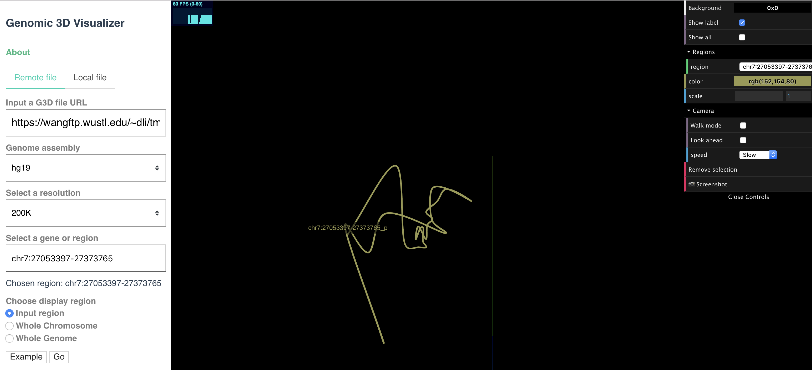

If you want to see whole chromosome structure, choose ``Whole Chromosome`` as display region, submit again:

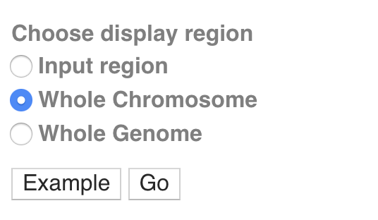

The display will update:

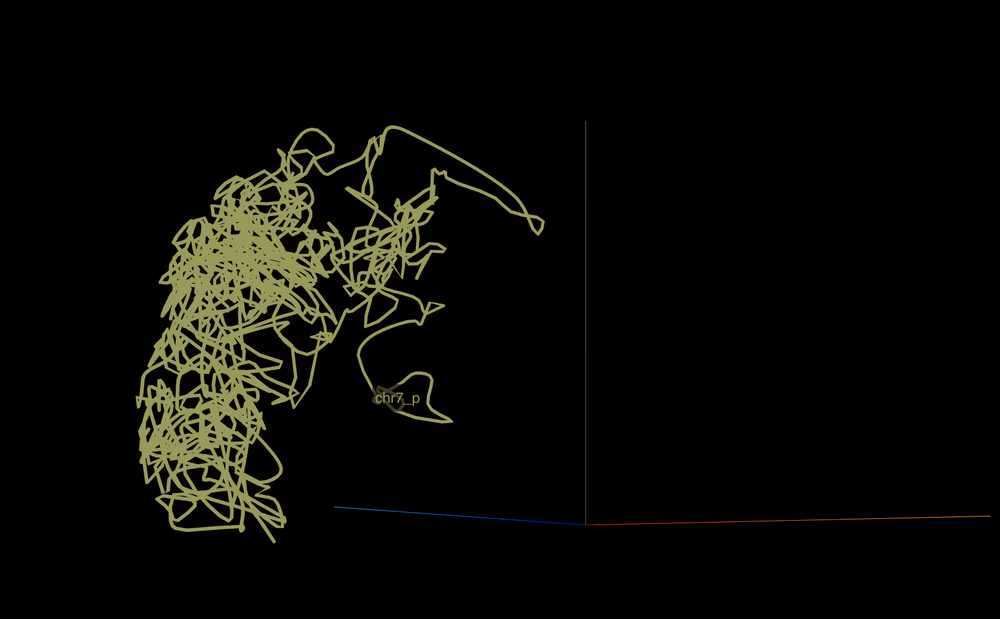

By default, only one 3D model will be displayed, either from maternal or paternal, or from one chromosome. One the display
scene, the right part shows the configuration menu for single mode:

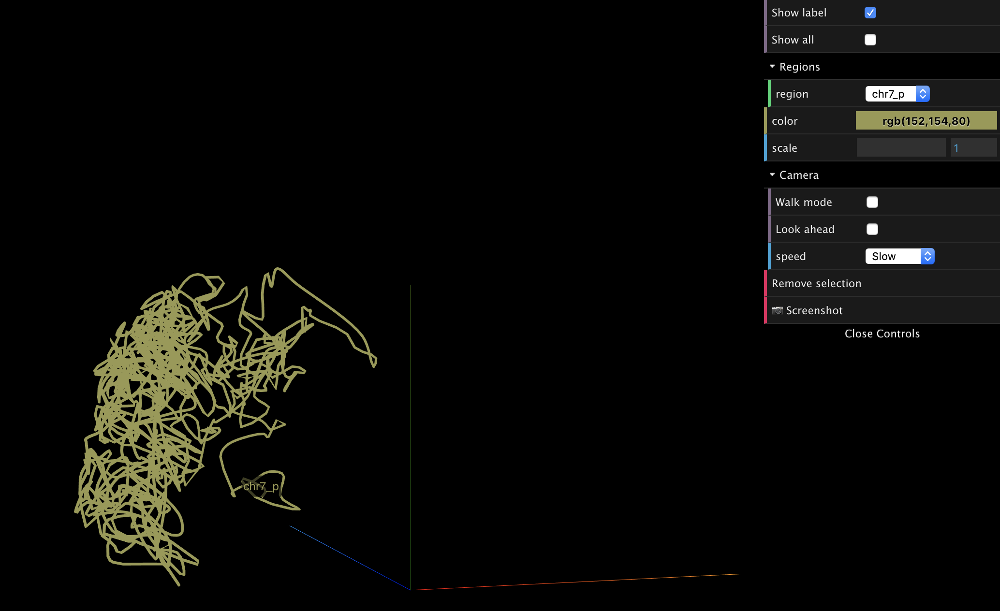

The ``Show all`` checkbox toggles single model mode or multiple models mode:

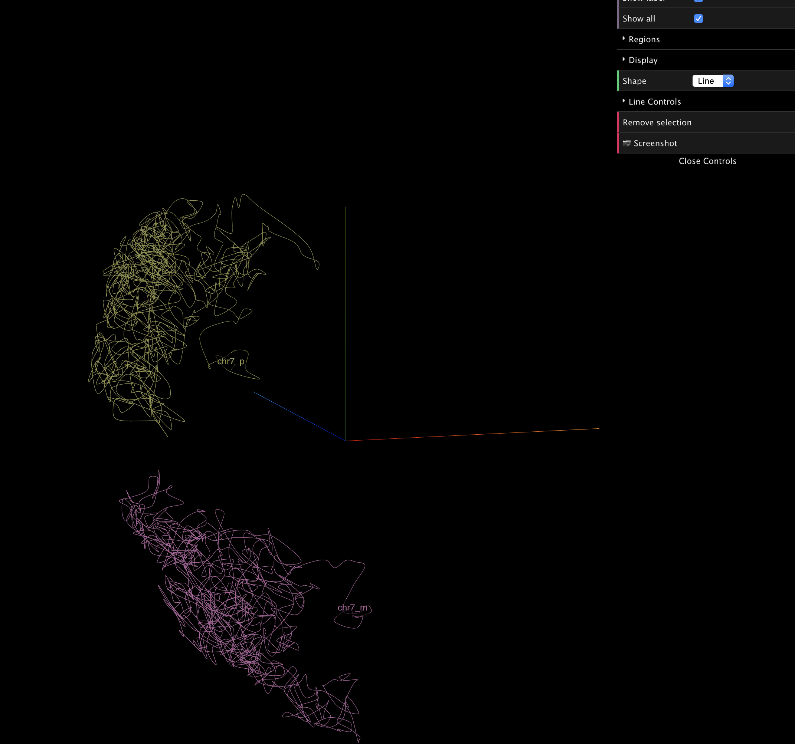

Display configurations
~~~~~~~~~~~~~~~~~~~~~~

The Background color can be changed if you move mouse over to the ``Background`` menu item, click the palette to change the color you liked:

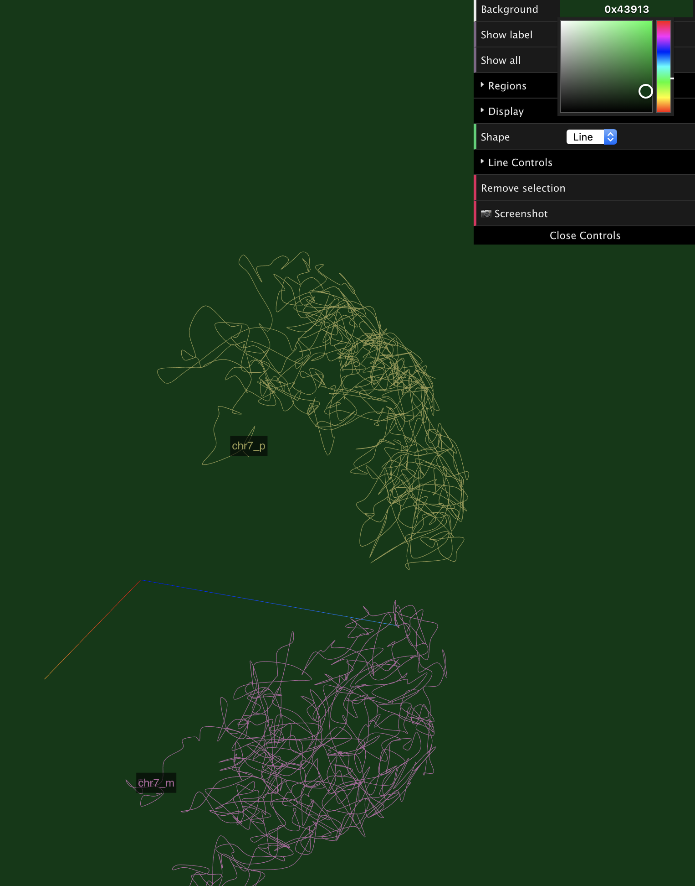

The label for each chromosome or region will be displayed by default:

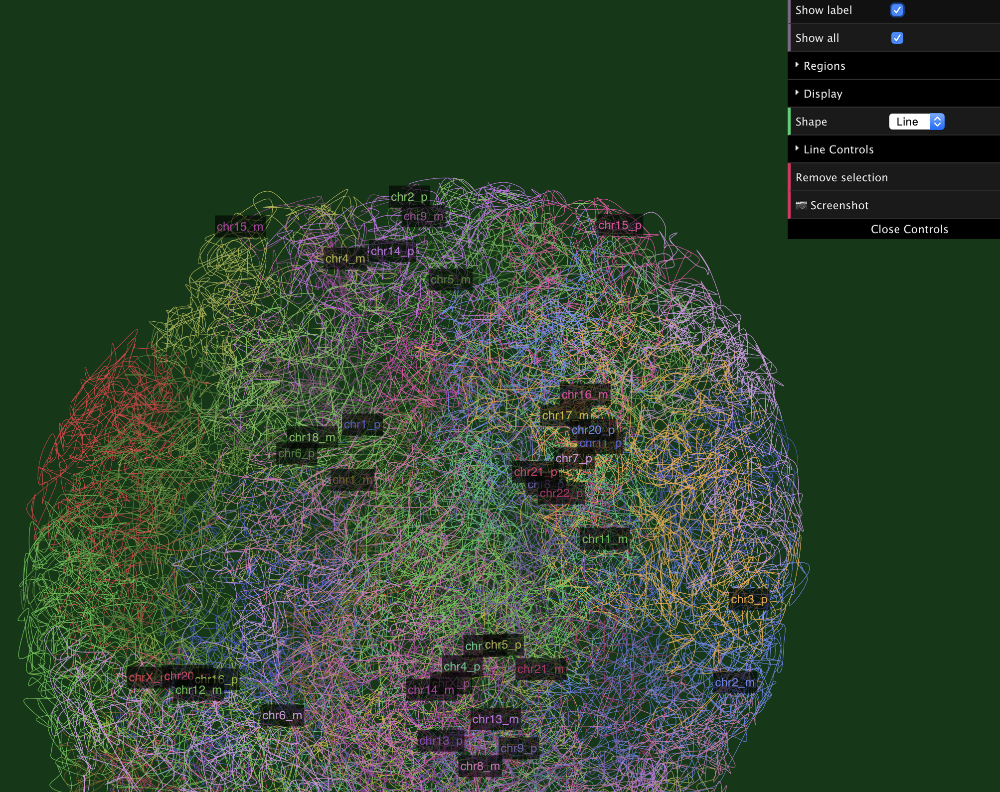

You can make them invisible by uncheck the ``Show label`` menu item:

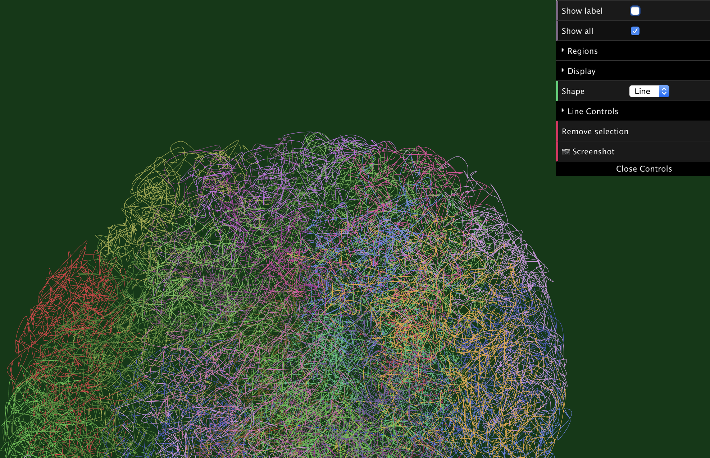

Single model mode
~~~~~~~~~~~~~~~~~

While at single model mode, there is a dropdown menu for selection which region/chromosome to display, we can also change the color and scale:

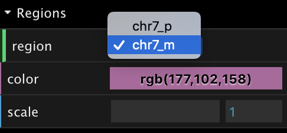

After adjusted region, color and scale:

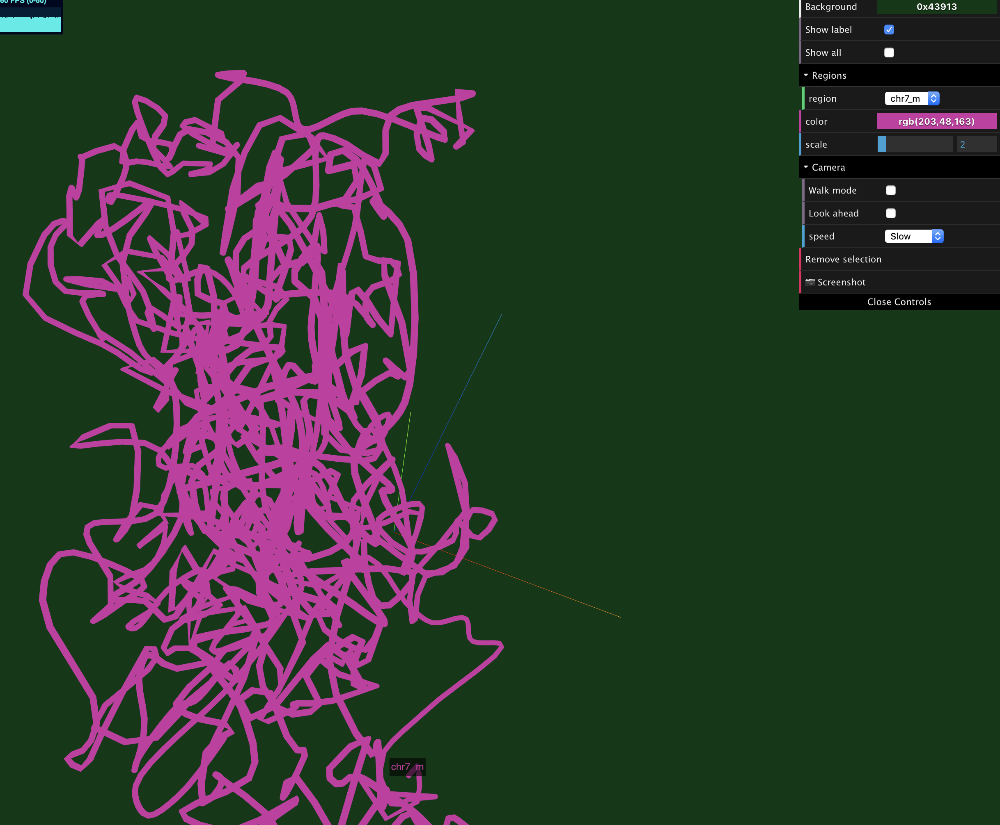

On single model mode, there is a walking camera provided to mimic the walk/run along with the reigon/chromosome:

.. image:: _static/walk_1.png

By checking the ``Walk mode`` checkbox, the view will start to move/walk. The speed can be adjusted as well.

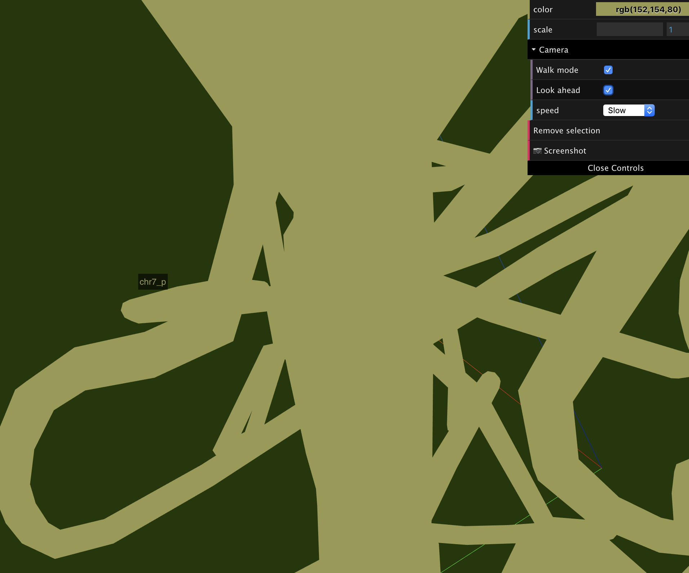

Multiple models mode
~~~~~~~~~~~~~~~~~~~~

Multiple modeles mode displays all 3D models, both from paternal and maternal, and from all chromosomes/regions. There are two
dropdown menus to change the color of each model, and toggle the display of each model. Also you can change the shape type to `line`, `tube` or `ball`.

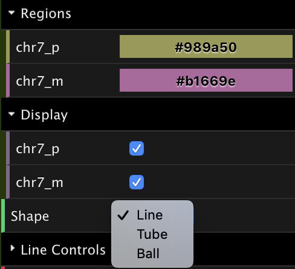

The image below shows while we changed shape type to `ball`:

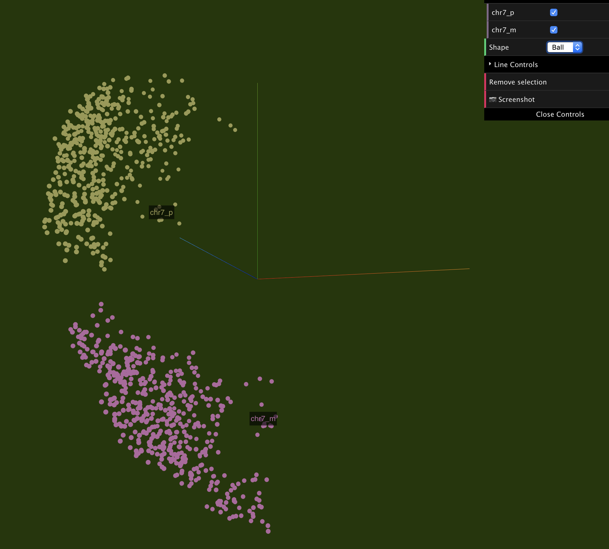

Screenshot
~~~~~~~~~~

Use the screenshot button (shown below) to take a screenshot, the generated screenshot will be the same as the time when you clicked the button.

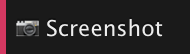

Try genomics 3D structure in AR mode
------------------------------------

* Please use your phone's camera point the QR code in the image below, Safari will popup and try to open our website, and will ask if allow to use the camera, please `Allow`

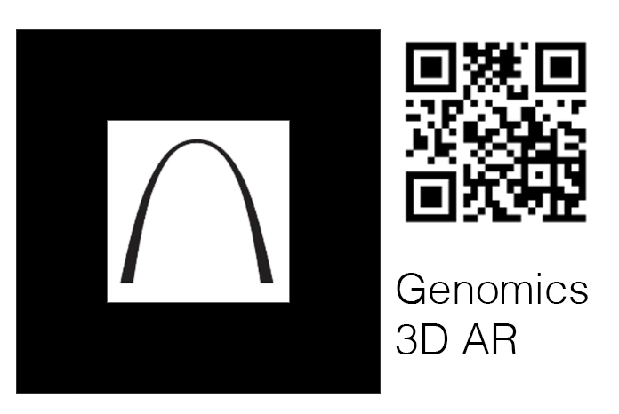

* then point the camera again to the Marker part (St. Louis Arch), and you will see the 3D structure in AR.

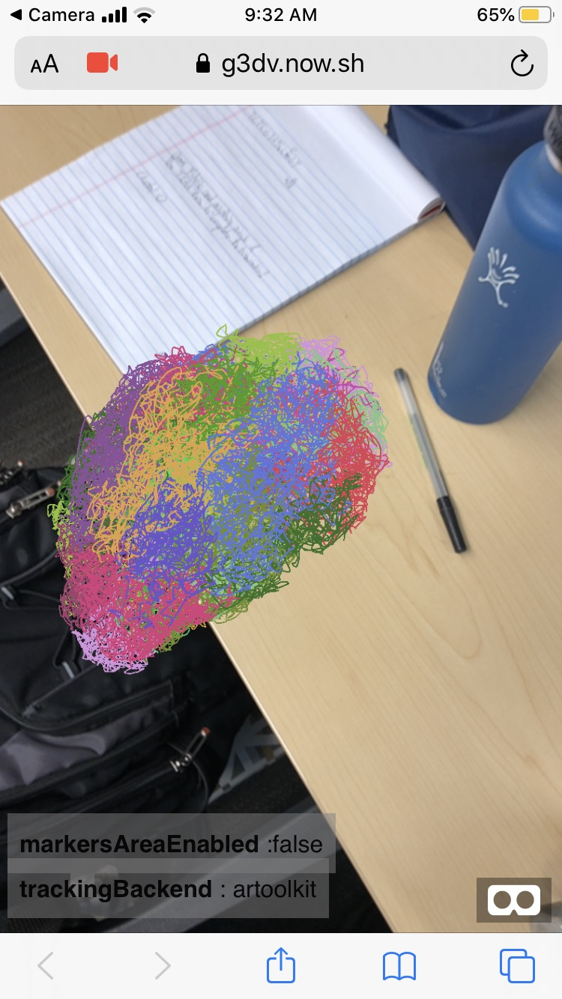
